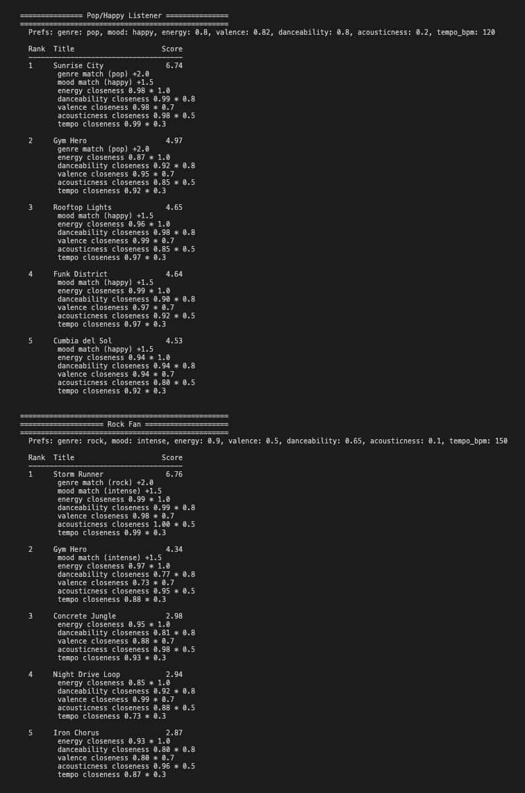
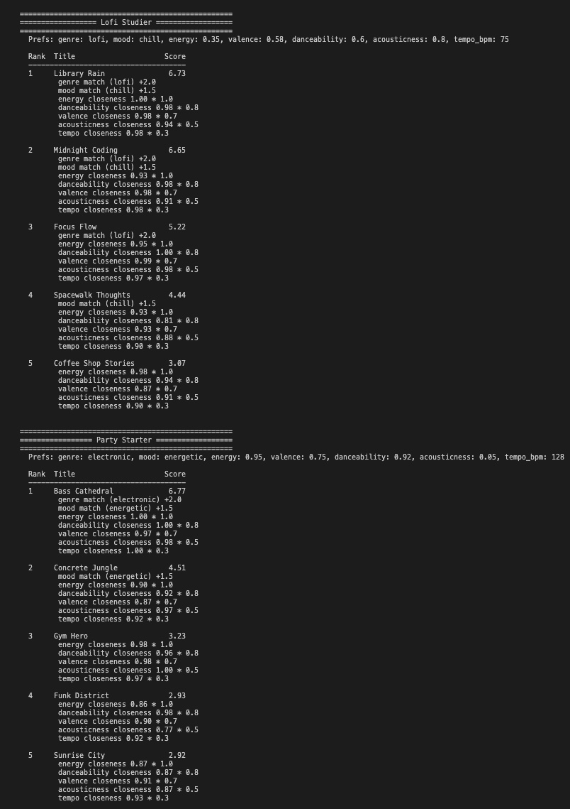
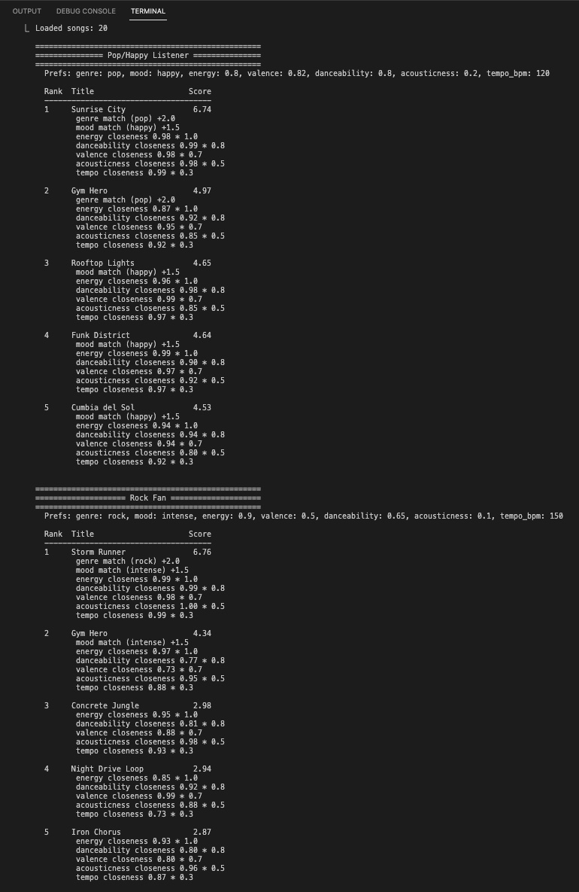
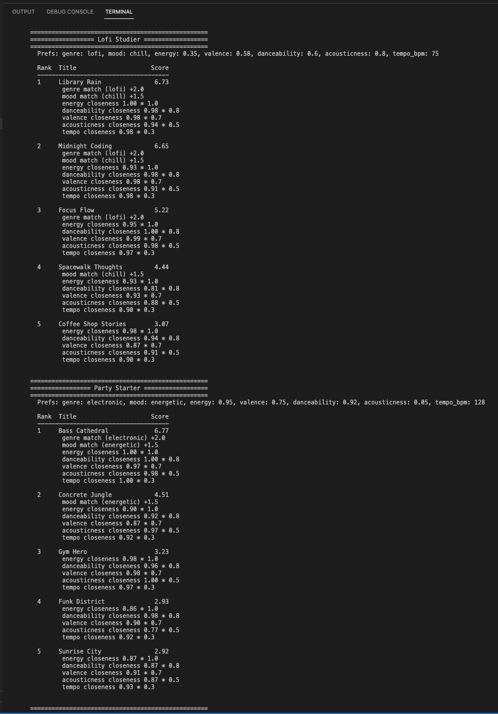
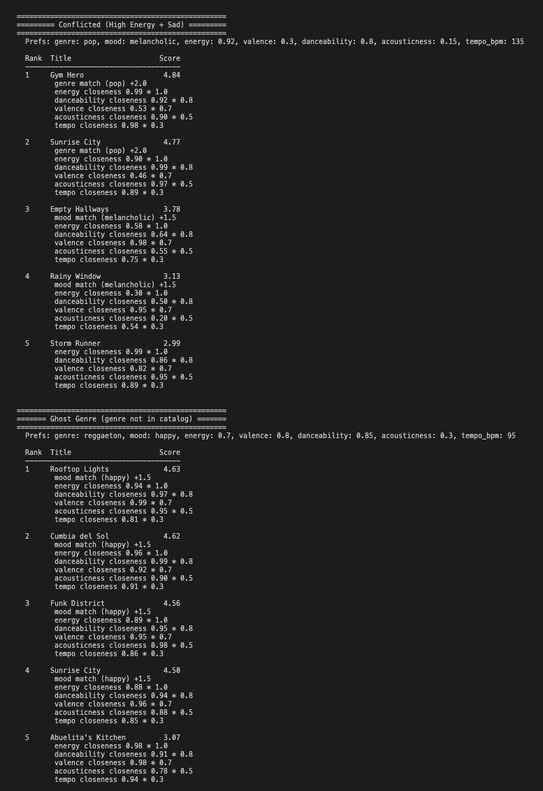
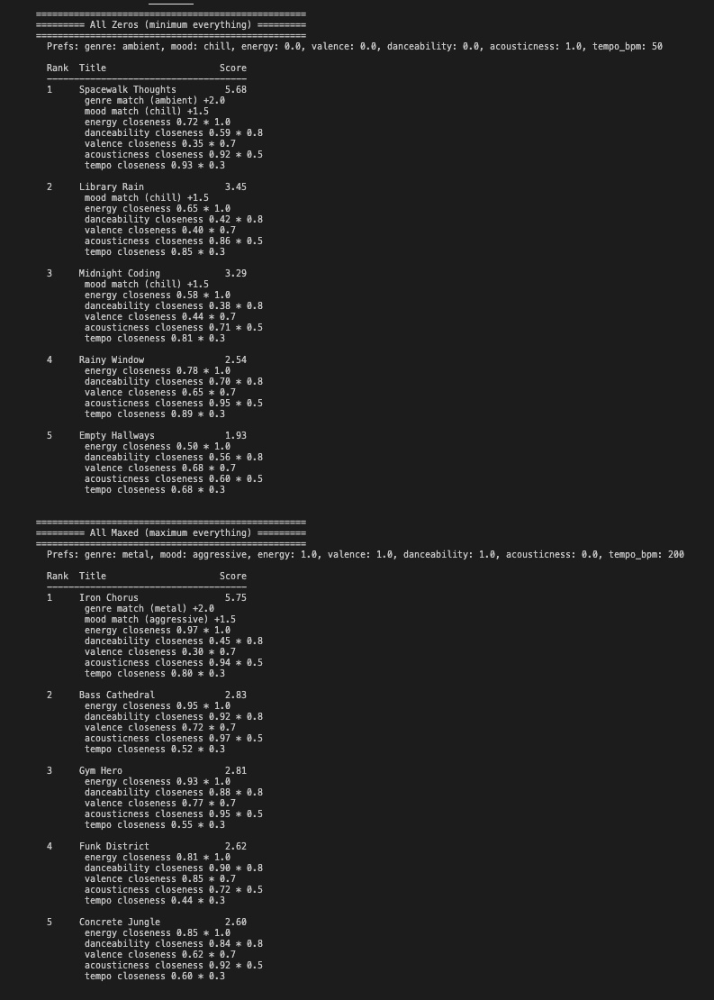
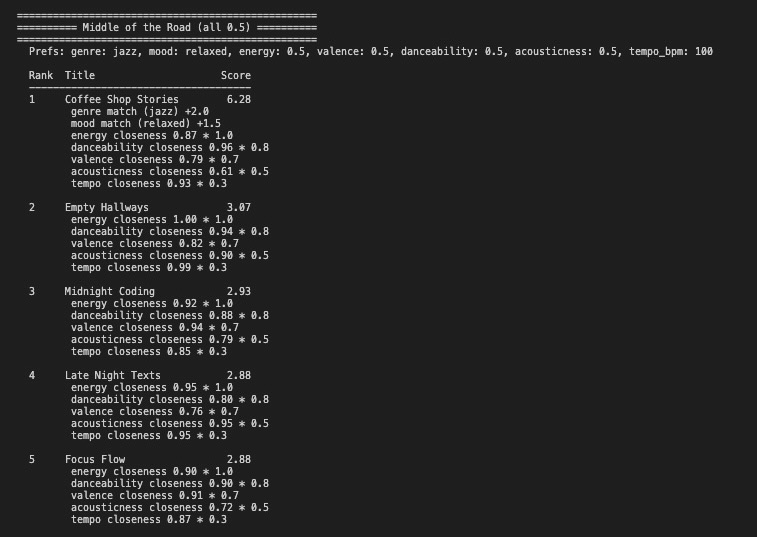

# 🎵 Music Recommender Simulation

## Project Summary

In this project you will build and explain a small music recommender system.

Your goal is to:

- Represent songs and a user "taste profile" as data
- Design a scoring rule that turns that data into recommendations
- Evaluate what your system gets right and wrong
- Reflect on how this mirrors real world AI recommenders

**VibeFinder 1.0** is a CLI-first, content-based music recommender that scores a catalog of 20 songs against a user's taste profile. It uses weighted categorical bonuses (genre +2.0, mood +1.5) and numeric closeness scoring across 5 features (energy, danceability, valence, acousticness, tempo) to rank and explain recommendations. The system was stress-tested with 9 user profiles — including adversarial edge cases — and a weight-shift experiment to identify biases like genre over-prioritization and catalog energy skew.

---

## How The System Works

Real-world music recommenders like Spotify and YouTube Music combine two strategies: **collaborative filtering**, which finds songs loved by users with similar taste, and **content-based filtering**, which matches song attributes (tempo, energy, mood) directly to a user's preferences. Our simulation focuses on content-based filtering — we score each song in a 20-song catalog against a user's taste profile and recommend the highest-scoring matches.

### Data Flow

```
Input (User Prefs)  -->  Process (Score Every Song)  -->  Output (Top K Ranked)
```

1. A user profile and the full song catalog are loaded
2. Each song is scored individually against the user's preferences
3. All scores are sorted highest-to-lowest
4. The top *k* songs are returned with explanations

### Song Features

Each `Song` object carries the following attributes from `data/songs.csv` (20 songs across 16 genres and 10 moods):

- **genre** — categorical (pop, lofi, rock, ambient, jazz, synthwave, indie pop, r&b, hip-hop, classical, electronic, latin, metal, folk, funk, alternative)
- **mood** — categorical (happy, chill, intense, relaxed, moody, focused, romantic, energetic, melancholic, nostalgic, aggressive, dreamy)
- **energy** — float 0–1, how intense the track feels
- **valence** — float 0–1, emotional positivity (high = happy, low = dark/moody)
- **danceability** — float 0–1, how suitable for movement/rhythm
- **acousticness** — float 0–1, organic vs. electronic production style
- **tempo_bpm** — beats per minute (normalized to 0–1 scale for scoring)

### UserProfile

Each `UserProfile` stores seven preference fields:

- **favorite_genre** — preferred genre (categorical)
- **favorite_mood** — preferred mood (categorical)
- **target_energy** — desired energy level (float 0–1)
- **target_valence** — desired emotional positivity (float 0–1)
- **target_danceability** — desired rhythm/groove level (float 0–1)
- **target_acousticness** — preference for organic vs. electronic sound (float 0–1)
- **target_tempo_bpm** — desired tempo in BPM (normalized for scoring)

### Algorithm Recipe

#### Scoring Rule (one song)

Each song is scored against the user profile using two types of comparison:

**Categorical bonuses** — flat points for exact matches:

| Feature | Points | Rationale |
|---------|--------|-----------|
| Genre match | +2.0 | Strongest preference signal; defines the fundamental sound |
| Mood match | +1.5 | Important but more flexible; people shift moods more easily than genres |

**Numeric closeness** — rewards similarity to the user's target, not just high or low values:

```
feature_score = (1 - |user_preference - song_value|) x weight
```

| Feature | Weight | Rationale |
|---------|--------|-----------|
| Energy | x 1.0 | Core "vibe" indicator, strongest numeric signal |
| Danceability | x 0.8 | Activity-driven, separates workout from study music |
| Valence | x 0.7 | Emotional tone, distinguishes feel-good from brooding |
| Acousticness | x 0.5 | Production style axis, less decisive on its own |
| Tempo | x 0.3 | Correlates with energy, lowest independent contribution |

**Total score** = genre bonus + mood bonus + sum of all weighted closeness scores

**Maximum possible score: ~6.8** (all categorical matches + all numeric closeness near 1.0)

#### Ranking Rule (all songs)

All 20 songs are scored, sorted highest-to-lowest, and the top *k* results are returned with per-song explanations listing the point breakdown.

### Test Profiles

The system ships with three profiles to validate differentiation:

| Field | Rock Fan | Lofi Studier | Party Starter |
|-------|----------|-------------|---------------|
| genre | rock | lofi | electronic |
| mood | intense | chill | energetic |
| energy | 0.90 | 0.35 | 0.95 |
| valence | 0.50 | 0.58 | 0.75 |
| danceability | 0.65 | 0.60 | 0.92 |
| acousticness | 0.10 | 0.80 | 0.05 |
| tempo_bpm | 150 | 75 | 128 |

### CLI Output

**Standard Profiles:**




**Edge Case / Adversarial Profiles:**







### Expected Biases and Limitations

- **Genre over-prioritization.** At 2.0 points, a genre match is worth more than any single numeric feature. A song that matches genre but misses on every other dimension can still outscore a near-perfect mood/energy match in a different genre. This means the system might ignore great songs that match the user's vibe but happen to be labeled differently.
- **Exact-match penalty for categorical features.** "Indie pop" and "pop" share significant overlap, but the system treats them as completely different genres (0 points). Similarly, "chill" and "relaxed" are close in meaning but score as a total mismatch.
- **No cross-user learning.** The system has no collaborative filtering — it cannot discover that users who like X also tend to like Y. Recommendations are limited to what the numeric attributes can capture.
- **Catalog size bias.** With only 20 songs, genres with more entries (e.g., 2 latin songs vs. 1 classical) have a higher chance of appearing in results, independent of quality of match.
- **Static taste assumption.** The profile is fixed — it cannot adapt to time of day, activity, or evolving taste within a session.

---

## Getting Started

### Setup

1. Create a virtual environment (optional but recommended):

   ```bash
   python -m venv .venv
   source .venv/bin/activate      # Mac or Linux
   .venv\Scripts\activate         # Windows

2. Install dependencies

```bash
pip install -r requirements.txt
```

3. Run the app:

```bash
python -m src.main
```

### Running Tests

Run the starter tests with:

```bash
pytest
```

You can add more tests in `tests/test_recommender.py`.

---

## Experiments You Tried

### Stress Test: 9 Profiles (4 Standard + 5 Adversarial)

We ran all 9 profiles and tracked which songs appeared most often in the top 5:

- **Gym Hero** appeared in **5 out of 9** top-5 lists — the most frequent song. Its high energy (0.93) and danceability (0.88) make it a "generalist" that scores well on numeric closeness for many profiles, even without categorical bonuses.
- Every profile produced a **different #1 song** (9 unique winners), confirming the genre/mood bonuses successfully differentiate profiles.

### Surprise: "Conflicted" Profile Exposed Genre Bias

The "Conflicted (High Energy + Sad)" profile asked for pop genre but melancholic mood. Result: **Gym Hero** (pop/happy, score 4.84) ranked #1 over **Empty Hallways** (alternative/melancholic, score 3.78). The pop genre bonus (+2.0) outweighed the melancholic mood match (+1.5), so the system recommended an upbeat gym track to someone feeling sad. Musically, this feels wrong — mood should matter more than genre when preferences conflict.

### Ghost Genre Degrades Gracefully

When requesting "reggaeton" (not in the catalog), the system never awards the +2.0 genre bonus. Mood (+1.5) becomes the top differentiator, and the system falls back to happy latin/funk songs (Rooftop Lights, Cumbia del Sol). Maximum possible score drops from ~6.8 to ~4.6. The system doesn't break, but it loses its strongest signal.

### Extreme Values (All Zeros / All Maxed) Don't Break the System

Both extreme profiles produced sensible results — "All Zeros" correctly surfaced the quietest, most acoustic tracks (Spacewalk Thoughts), while "All Maxed" found the loudest, most intense tracks (Iron Chorus). However, "All Maxed" only scored 5.75 because no song has maximum values across all features simultaneously (danceability and valence are low for metal).

### Weight Shift Experiment: Genre 2.0→1.0, Energy 1.0→2.0

We halved the genre weight and doubled the energy weight, then compared results:

| Profile | Before (#1 → #5) | After (#1 → #5) |
|---------|-------------------|------------------|
| **Pop/Happy** | Sunrise City (6.74), Gym Hero, Rooftop Lights, Funk District, Cumbia del Sol | Sunrise City (6.72), Funk District, Rooftop Lights, Cumbia del Sol, Gym Hero |
| **Conflicted** | Gym Hero (4.84), Sunrise City, Empty Hallways, Rainy Window, Storm Runner | Gym Hero (4.83), Sunrise City, **Empty Hallways (4.36)**, Storm Runner, Concrete Jungle |
| **Ghost Genre** | Rooftop Lights (4.63), Cumbia del Sol, Funk District, Sunrise City, Abuelita's Kitchen | Cumbia del Sol (5.58), Rooftop Lights, Funk District, Sunrise City, Abuelita's Kitchen |

**Key observations:**

- **Conflicted profile improved.** Empty Hallways (melancholic) rose from 3.78 to 4.36, closing the gap with Gym Hero. With less genre dominance, mood and energy closeness carry more weight. Still not #1, but the ranking feels more balanced.
- **Ghost Genre improved.** Without the +2.0 genre bonus (which never fires for "reggaeton"), scores rose across the board (4.63 → 5.58 for #1) because energy closeness now contributes more. The system is less penalized by a missing genre.
- **Pop/Happy stayed stable.** Sunrise City stayed #1 — it matches on both genre and mood regardless of weight. But Gym Hero dropped from #2 to #5 because its energy advantage matters less when genre is worth less.
- **Verdict:** The change made recommendations *more accurate* for conflicting/edge-case profiles but *slightly less decisive* for clear-cut profiles. The original weights (genre=2.0) are better for typical users; the experimental weights (energy=2.0) are better for edge cases. A production system might adjust weights dynamically based on how conflicting the preferences are.

---

## Limitations and Risks

Summarize some limitations of your recommender.

Examples:

- It only works on a tiny catalog
- It does not understand lyrics or language
- It might over favor one genre or mood

You will go deeper on this in your model card.

- **Genre over-prioritization creates filter bubbles.** At 2.0 points, genre match dominates all other signals. "Indie pop" and "pop" are treated as completely unrelated (0 bonus), so a pop fan will never see great indie pop songs ranked highly.
- **Mood blindness under conflict.** The "Conflicted" profile (pop + melancholic) recommends an upbeat gym track because genre (+2.0) outweighs mood (+1.5). The system cannot detect when preferences are contradictory.
- **High-energy catalog bias.** 50% of songs have energy >= 0.7 vs. only 25% below 0.4. Low-energy users get fewer options and less variety.
- **No discovery mechanism.** The system always returns the closest matches — it will never surface a surprising song the user might love from an unexpected genre.
- **Does not understand lyrics, language, or cultural context.** Two songs can have identical numeric features but completely different lyrical meaning.

See [model_card.md](model_card.md) for deeper analysis.

---

## Reflection

Read and complete `model_card.md`:

[**Model Card**](model_card.md)

Write 1 to 2 paragraphs here about what you learned:

- about how recommenders turn data into predictions
- about where bias or unfairness could show up in systems like this

**What was my biggest learning moment?**
The turning point was the "Conflicted" user profile — someone who said they like pop but are feeling melancholic. The system recommended Gym Hero, an upbeat gym anthem, as the #1 pick. On paper the math was correct: pop genre bonus (+2.0) beat the melancholic mood bonus (+1.5). But musically it was completely wrong. Nobody who is feeling sad wants a hype track blasted at them. That single result made me understand that an algorithm can follow its rules perfectly and still produce an answer that a human would immediately recognize as bad. It showed me that the real design challenge isn't writing the formula — it's choosing what the formula should care about.

**How did AI tools help, and when did I need to double-check them?**
AI tools were most valuable for scaffolding and speed. They generated the 10 additional CSV songs with diverse genres, suggested the closeness formula (`1 - |user - song|`), structured the CLI output formatting, and helped draft the Mermaid flowcharts. I saved significant time on boilerplate. But I had to double-check in three places: (1) the weight rationale — the AI suggested numbers but couldn't explain why genre should be 2.0 vs. 1.5 from a musical perspective, so I reasoned through that myself; (2) tempo normalization — I caught that tempo_bpm (range 50–200) needed to be scaled to 0–1 before it could be compared fairly to features already on that scale; (3) the adversarial profiles — the AI didn't proactively suggest testing contradictory preferences like "high energy + sad mood," which turned out to be the most revealing test. The lesson is that AI tools are excellent at generating correct code but less reliable at questioning whether the logic behind the code makes sense.

**What surprised me about how simple algorithms can still "feel" like recommendations?**
I was genuinely surprised that seven weighted features and basic arithmetic could produce results that feel like a real playlist. When the Lofi Studier got Library Rain and Midnight Coding, or the Party Starter got Bass Cathedral, those felt like something a human DJ would pick. The trick is that combining multiple weak signals creates an illusion of understanding — no single feature is smart, but together they approximate taste well enough to seem intelligent. What surprised me equally was how fast that illusion breaks. One edge-case profile was enough to expose a fundamental flaw. Real platforms like Spotify must spend enormous effort on the 5% of cases where simple matching fails, because those are the moments users lose trust.

**What would I try next?**
Three things. First, fuzzy genre matching — instead of "pop" and "indie pop" being a binary 0-or-2.0 choice, I would build a genre similarity map where related genres earn partial credit (maybe 1.0 for "indie pop" when the user wants "pop"). Second, a diversity constraint — after picking the top 3 closest matches, fill the remaining 2 slots with songs from different genres to deliberately break filter bubbles. Third, context-aware profiles — letting the same user have a "workout" profile and a "study" profile, because a single fixed taste snapshot can't capture how real people listen to music throughout their day.

The detailed profile-pair comparisons are in [reflection.md](reflection.md).


---

## Model Card Summary

Combines reflection and model card framing from the Module 3 guidance.

### 1. Model Name

> **VibeFinder 1.0**

### 2. Intended Use

- What is this system trying to do
- Who is it for

> This model suggests 5 songs from a 20-song catalog based on a user's preferred genre, mood, energy, valence, danceability, acousticness, and tempo. It is a classroom simulation for exploring content-based filtering — not for real users or production use.

### 3. How It Works (Short Explanation)

- What features of each song does it consider
- What information about the user does it use
- How does it turn those into a number

> The system compares every song to a user's taste profile. If the genre or mood matches exactly, the song gets bonus points (genre is worth more because it defines the core sound). For numeric features like energy and danceability, the system measures how close the song is to what the user wants — a perfect match scores 1.0, a total mismatch scores 0.0. Each feature is weighted by importance, all the points are added up, and the songs are ranked highest to lowest.

### 4. Data

- How many songs are in `data/songs.csv`
- Did you add or remove any songs
- What kinds of genres or moods are represented
- Whose taste does this data mostly reflect

> 20 songs across 16 genres and 12 moods. The original 10-song starter was expanded with 10 additional songs to cover r&b, hip-hop, classical, electronic, latin, metal, folk, funk, and alternative. The catalog skews toward high energy (50% of songs have energy >= 0.7) and Western indie/electronic taste. Missing: country, reggae, K-pop, classical vocal.

### 5. Strengths

- Situations where the top results "felt right"
- Particular user profiles it served well
- Simplicity or transparency benefits

> Clear-cut profiles (Rock Fan, Lofi Studier, Party Starter) get excellent results — the #1 recommendation is always the right song. Every recommendation includes a point-by-point explanation, making it transparent and easy to debug. The system handles missing genres gracefully without crashing. Across 9 test profiles, every one got a unique #1 song.

### 6. Limitations and Bias

- Does it ignore some genres or moods
- Does it treat all users as if they have the same taste shape
- Is it biased toward high energy or one genre by default
- How could this be unfair if used in a real product

> Genre over-prioritization creates filter bubbles — "indie pop" and "pop" are treated as completely unrelated. The "Conflicted" profile (pop + melancholic) recommends an upbeat gym anthem because genre (+2.0) outweighs mood (+1.5), exposing mood blindness. The catalog has a high-energy bias (50% vs. 25% low-energy), giving chill listeners less variety. No discovery mechanism means users never see surprising cross-genre suggestions. In a real product, this would trap users in taste bubbles and underserve anyone whose genre isn't well-represented.

### 7. Evaluation

- Which user profiles you tested
- What you looked for in the recommendations
- What surprised you
- Any simple tests or comparisons you ran

> Tested 9 profiles: 4 standard (Pop/Happy, Rock Fan, Lofi Studier, Party Starter) and 5 adversarial (Conflicted, Ghost Genre, All Zeros, All Maxed, Middle of the Road). Tracked song frequency — "Gym Hero" appeared in 5/9 top-5 lists as a generalist. Ran a weight-shift experiment (genre 2.0→1.0, energy 1.0→2.0) and found it improved edge-case accuracy but reduced decisiveness for typical profiles. All changes validated with 2 automated tests passing.

### 8. Future Work

- Additional features or preferences
- Better ways to explain recommendations
- Improving diversity among the top results
- Handling more complex user tastes

> Fuzzy genre matching (partial credit for "indie pop" vs. "pop"). Dynamic weight adjustment when preferences conflict. Diversity injection — fill remaining slots with songs from different genres after picking the top matches. Multi-profile support (workout vs. study vs. commute). Collaborative filtering to discover songs the content-based system would miss.

### 9. Personal Reflection

- What surprised you about how your system behaved
- How did building this change how you think about real music recommenders
- Where do you think human judgment still matters, even if the model seems "smart"

> The biggest surprise was how a system can be mathematically correct but musically wrong — the Conflicted profile recommending a gym anthem to someone feeling sad made algorithmic bias tangible. Building this changed how I think about Spotify's Discover Weekly: when it surfaces something unexpected that I love, that's a deliberate design choice to break exactly the kind of filter bubble this system creates. Human judgment still matters in deciding what the math should optimize for — the weights are subjective choices, not objective truths. AI tools helped with scaffolding (CSV generation, formula suggestions, formatting) but I had to double-check weight rationale and catch the tempo normalization issue myself.

