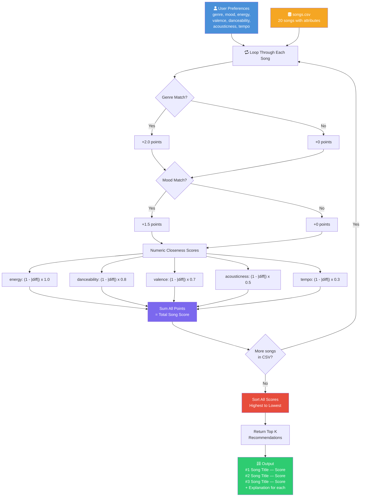
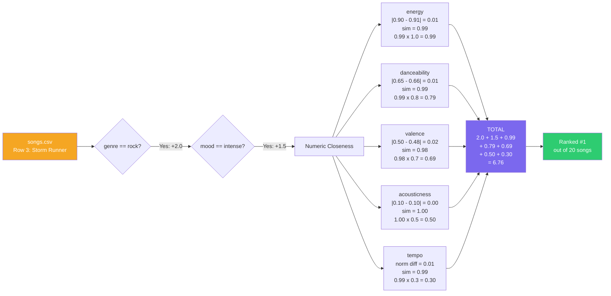

# Recommender System — Data Flow Design

## Text Map

```
INPUT                    PROCESS                           OUTPUT
─────                    ───────                           ──────
User Prefs               The Loop                          The Ranking
  genre: "rock"    ┐
  mood: "intense"  │     For EACH song in songs.csv:       Sorted list
  energy: 0.90     ├──>    1. Compare genre  (+2.0)  ──>   #1 Storm Runner   6.76
  valence: 0.50    │       2. Compare mood   (+1.5)        #2 Gym Hero       4.34
  danceability: 0.65│      3. Calc energy closeness         #3 Concrete Jungle 2.98
  acousticness: 0.10│      4. Calc valence closeness        #4 Night Drive    2.94
  tempo_bpm: 150   ┘       5. Calc dance closeness          #5 Iron Chorus    2.87
                           6. Calc acoustic closeness
songs.csv (20 songs)       7. Calc tempo closeness
                           8. Sum weighted scores
                                    │
                                    v
                           Sort all scores descending
                                    │
                                    v
                           Return top K songs
```

## Mermaid.js Flowchart



## How a Single Song Moves Through the Pipeline

Taking **"Storm Runner"** (rock, intense, energy 0.91) scored against the **Rock Fan** profile:


